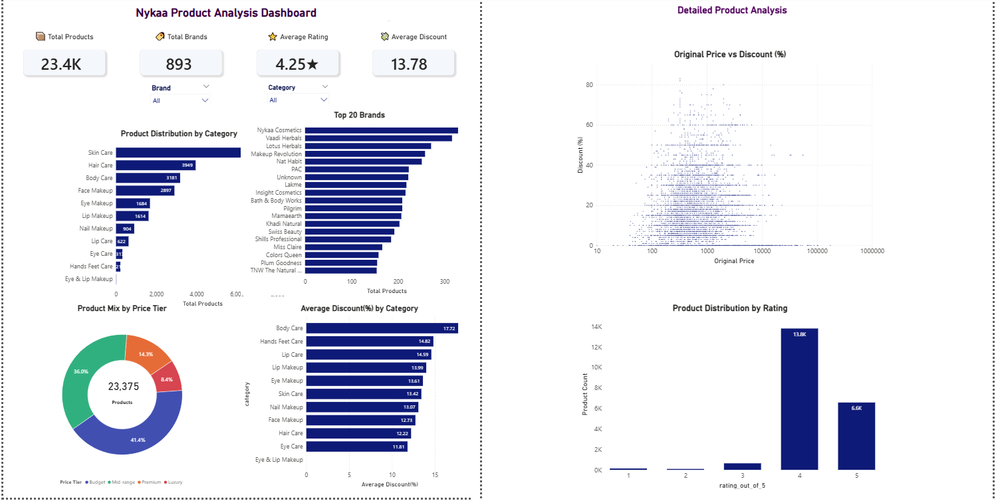
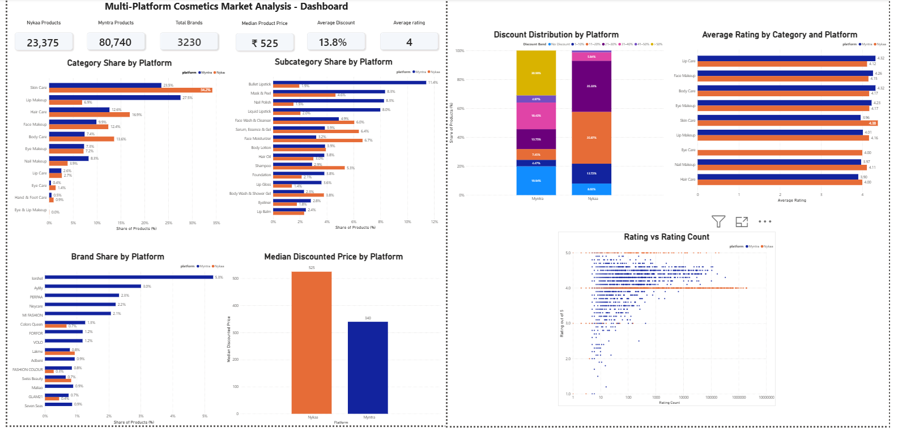

# Multi-Platform Cosmetics Market Analysis

## Project Overview

This project analyzes the Indian online cosmetics market using product data collected from two e-commerce platforms: Nykaa and Myntra.

The product data was scraped and cleaned separately for each platform and subsequently analyzed using Python, SQL, and Power BI.

The project compares Nykaa and Myntra in terms of product assortment, categories, subcategories, brands, pricing, discounts, and customer ratings to identify differences in their marketplace and promotional strategies.

## Objectives

- Scrape product data from Nykaa and Myntra.
- Clean and validate the scraped datasets.
- Perform exploratory analysis of the Nykaa product dataset.
- Conduct SQL-based business analysis of the Nykaa dataset.
- Develop Power BI dashboards for Nykaa and cross-platform analysis.
- Combine the cleaned Nykaa and Myntra datasets into a common analytical dataset.
- Standardize relevant fields for meaningful cross-platform comparison.
- Compare product, category, subcategory, and brand assortment.
- Compare product pricing and discount patterns.
- Compare customer ratings and rating-related metrics.
- Examine selected relationships between product-level variables.
- Identify key differences in the assortment, pricing, promotional, and customer-rating patterns of Nykaa and Myntra.
- Derive business insights from the collected data.

## Data Sources

The project uses product data collected from:

- Nykaa
- Myntra

The data was collected specifically for this project through web scraping.

## Data Collection

Product data was collected from the publicly accessible product listings of Nykaa and Myntra.

The scraped datasets were cleaned and prepared for exploratory analysis and visualization.

## Tools & Technologies

- **Python**
- **PyCharm Community Edition**
- **Jupyter Notebook / JupyterLab**
- **Web Scraping**
- **Selenium**
- **Pandas**
- **NumPy**
- **Matplotlib**
- **MySQL**
- **MySQL Workbench**
- **Power BI**
- **GitHub**
- **GitHub Desktop**

## Project Progress

| Phase | Status |
|---|---|
| 1. Web Scraping – Nykaa | ✅ Completed |
| 2. Data Cleaning – Nykaa | ✅ Completed |
| 3. Exploratory Data Analysis – Nykaa | ✅ Completed |
| 4. SQL Business Analysis – Nykaa | ✅ Completed |
| 5. Power BI Dashboard – Nykaa | ✅ Completed |
| 6. Web Scraping – Myntra | ✅ Completed |
| 7. Data Cleaning – Myntra | ✅ Completed |
| 8. Cross-Platform Analysis | ✅ Completed |
| 9. Cross-Platform Power BI Dashboard | ✅ Completed |

## Repository Structure

```text
Multi-Platform-Cosmetics-Market-Analysis/
│
├── README.md
│
├── 01_Nykaa_Scraping/
│   ├── main.py
│   ├── brands.py
│   └── add_brand.py
│
├── 02_Nykaa_Data_Cleaning/
│   └── nykaa_data_cleaning.ipynb
│
├── 03_Nykaa_EDA/
│   └── nykaa_eda.ipynb
│
├── 04_Nykaa_SQL_Analysis/
│   └── nykaa_business_analysis.sql
│
├── 05_Nykaa_PowerBI/
│   ├── nykaa_dashboard.pbix
│   └── nykaa_dashboard.png
│
├── 06_Myntra_Scraping/
│   └── main.py
│
├── 07_Myntra_Data_Cleaning/
│   └── myntra_data_cleaning.ipynb
│
├── 08_Cross_Platform_Analysis/
│   └── cross_platform_analysis.ipynb
│
└── 09_Cross_Platform_PowerBI/
    ├── crossplatform_dashboard.pbix
    └── crossplatform_dashboard.png


## Data Description

The datasets contain product-level information such as:

- Product Name
- Product URL
- Category
- Sub-category
- Brand
- Original Price
- Discounted Price
- Discount Percentage
- Rating
- Rating Count
- Platform
- Other platform-specific attributes

Relevant fields were standardized where necessary to enable cross-platform comparison.

## Analysis

The cross-platform analysis compares the cleaned Nykaa and Myntra product datasets to identify differences in product assortment, pricing, promotional strategies, and customer response.

The analysis examines:

* **Product Assortment**

  * Compare the overall product, category, subcategory, and brand coverage across Nykaa and Myntra.

* **Category Analysis**

  * Compare product distribution across standardized categories on each platform.
  * Analyze both product counts and the percentage share of each platform's total assortment.

* **Subcategory Analysis**

  * Compare product distribution across standardized subcategories.
  * Identify subcategories with stronger representation on each platform using product counts and platform-level assortment share.

* **Brand Analysis**

  * Compare brand breadth and product distribution across the two platforms.
  * Analyze the leading brands by product count and their share of each platform's assortment.

* **Price Analysis**

  * Compare discounted price distributions between Nykaa and Myntra.
  * Compare mean and median product prices.
  * Analyze median price differences across comparable product categories.

* **Discount Analysis**

  * Compare average and median discount percentages across the platforms.
  * Analyze the distribution of products across different discount bands.
  * Examine differences in promotional discount patterns between Nykaa and Myntra.

* **Rating Analysis**

  * Compare product ratings across the two platforms using mean, median, and rating variation.
  * Examine differences in the availability of rating-related data.

* **Relationship Analysis**

  * Analyze the relationship between product rating and rating count.
  * Examine the relationship between original price and discount percentage using correlation analysis.

The analysis uses standardized category and subcategory fields where clear correspondences exist between the two platforms, enabling more meaningful cross-platform comparisons.


## Power BI Dashboards

### Nykaa Power BI Dashboard

The Nykaa Power BI dashboard presents insights into product assortment, pricing, discounts, ratings, reviews, brands, and categories.



### Cross-Platform Power BI Dashboard

The cross-platform Power BI dashboard compares Nykaa and Myntra across product assortment, pricing, discounts, ratings, brands, and categories.



## Key Insights

### Product Assortment

Myntra has a substantially larger product assortment and a broader brand presence in the collected dataset than Nykaa.

### Assortment Structure

The two platforms have noticeably different category and subcategory structures. Standardization was necessary to make comparable product groups easier to analyze.

### Price Positioning

Myntra has a lower median discounted price (₹340) than Nykaa (₹525), indicating a higher typical price position on Nykaa.

### Discount Strategy

Myntra follows a substantially more aggressive discounting strategy. Approximately 21.7% of its products fall into the >50% discount band, compared with approximately 1.4% on Nykaa.

### Customer Ratings

Average ratings are almost identical between the platforms: 4.26 on Myntra and 4.25 on Nykaa.

### Relationships

Rating count has almost no linear relationship with rating on either platform. Original price also shows little relationship with discount percentage.

## Limitations

- The analysis is based on scraped product listings available at the time of data collection.
- Product availability and prices may change over time.
- The datasets may not represent the entire Indian online cosmetics market.
- Differences in product listings between platforms may affect direct comparisons.

## Future Improvements

- Expand the dataset with additional e-commerce platforms
- Automate periodic data collection
- Add historical price tracking
- Perform sentiment analysis on customer reviews
- Develop additional predictive analytics

## Author
Neethu Raj P
